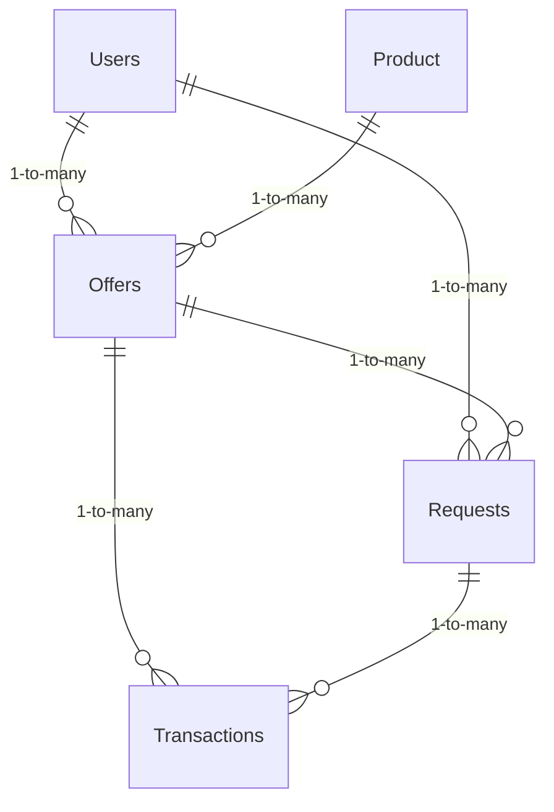

    Users {        
        string Username
        string required Email
        string required StringLength(50) FirstName
        string required StringLength(50) LastName                
        string Address
        string City
        string PostNumber        
        datetime DateCreated
    }

    Product {
        int ProductId PK
        string StringLength(50) Name
        string Description
    }

    Offers {
        int OfferId PK
        int UserId FK
        int ProductId FK
        decimal required Quantity
        boolean required IsFree
        decimal Price
        datetime DateCreated
        datetime ExpirationDate
    }

    Requests {
        int RequestId PK
        int UserId FK
        int OfferId FK
        decimal required Quantity
        datetime DateCreated
    }

    Transactions {
        int TransactionId PK
        int OfferId FK
        int RequestId FK
        decimal required Quantity
        datetime TransactionDate
    }

